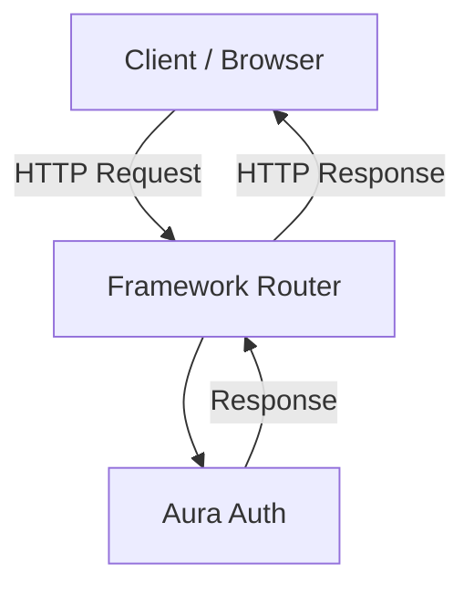

Aura Auth is designed to be **framework-agnostic**, allowing it to integrate seamlessly with virtually any web framework, library, or even a plain JavaScript application.

This is made possible by its [Runtime Agnostic](/docs/concepts/runtime-agnostic) architecture, which relies exclusively on standard Web APIs such as **Request**, **Response**, **Fetch**, and **Web Crypto**, instead of framework-specific abstractions.

As a result, Aura Auth can be integrated into frameworks like **Next.js**, **Hono**, **Express**, **Elysia**, and many others without requiring runtime-specific implementations or complex adapters.

<Callout>

Aura Auth is actively developed, and contributions are always welcome. If you'd like to add first-class support for your favorite framework or library, feel free to open a pull request.

For step-by-step instructions, see the [Integration Guide](/docs/guides/integration-guide).

</Callout>

## Supported Frameworks

| Framework                           | Official Package | Resources                                                                                                                                                        |
| ----------------------------------- | :--------------: | ---------------------------------------------------------------------------------------------------------------------------------------------------------------- |
| Elysia                              |        ✅        | [Package](https://github.com/aura-stack-ts/auth/tree/master/packages/elysia) · [Demo](https://github.com/aura-stack-ts/auth/tree/master/apps/elysia)             |
| Express                             |        ✅        | [Package](https://github.com/aura-stack-ts/auth/tree/master/packages/express) · [Demo](https://github.com/aura-stack-ts/auth/tree/master/apps/express)           |
| React                               |        ✅        | [Package](https://github.com/aura-stack-ts/auth/tree/master/packages/react) · [Demo](https://github.com/aura-stack-ts/auth/tree/master/apps/react)               |
| React Router                        |        ✅        | [Package](https://github.com/aura-stack-ts/auth/tree/master/packages/react-router) · [Demo](https://github.com/aura-stack-ts/auth/tree/master/apps/react-router) |
| Next.js (App Router & Pages Router) |        ✅        | [Package](https://github.com/aura-stack-ts/auth/tree/master/packages/next) · [Demo](https://github.com/aura-stack-ts/auth/tree/master/apps/nextjs)               |
| Hono                                |        ✅        | [Package](https://github.com/aura-stack-ts/auth/tree/master/packages/hono) · [Demo](https://github.com/aura-stack-ts/auth/tree/master/apps/hono)                 |
| Nuxt                                |        ❌        | [Demo](https://github.com/aura-stack-ts/auth/tree/master/apps/nuxt)                                                                                              |
| Oak                                 |        ❌        | [Demo](https://github.com/aura-stack-ts/auth/tree/master/apps/oak)                                                                                               |
| Astro                               |        ❌        | [Demo](https://github.com/aura-stack-ts/auth/tree/master/apps/astro)                                                                                             |
| SvelteKit                           |        ❌        | Coming soon                                                                                                                                                      |

> **Note:** Even if a framework doesn't have an official integration package yet, Aura Auth can typically be integrated by following the Integration Guide.

## How it works

Aura Auth doesn't sit behind a framework-specific abstraction. Instead, your framework receives an HTTP request, forwards it to Aura Auth, and returns the resulting HTTP response.

## Benefits

- **No framework lock-in** — Use Aura Auth with the framework that best fits your project.
- **Minimal integration layer** — Most frameworks only require forwarding standard `Request` and `Response` objects.
- **Smaller bundles** — No framework-specific runtime or adapter dependencies are required.
- **Easy to extend** — New framework integrations can be added without changing Aura Auth's core.
- **Future-proof** — As new frameworks adopt the standard Web APIs, they can integrate with Aura Auth using the same architecture.

By building on Web Standards instead of framework-specific APIs, Aura Auth provides a consistent authentication experience across the JavaScript ecosystem while remaining lightweight, portable, and easy to integrate.
