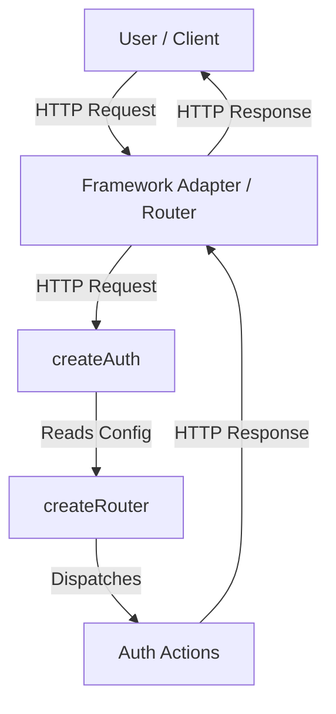
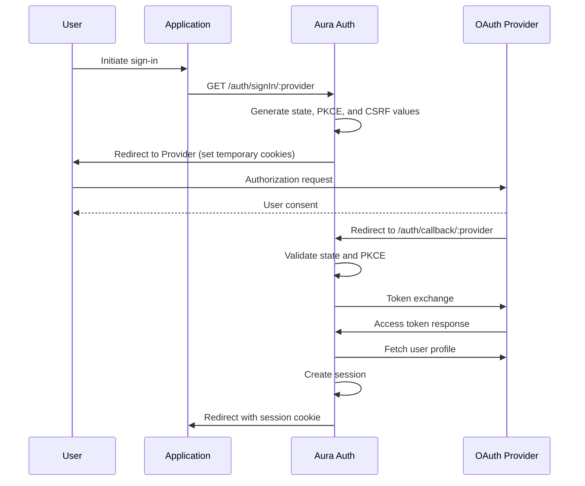

Aura Auth is built with a modular architecture enabling flexibility across different JavaScript environments.

## What you'll learn

This architecture concept guide covers the architecture, data flow, and key responsibilities of Aura Auth.

- [High-Level Overview](#high-level-overview)
- [Key Components](#key-components)
- [Data Flow: OAuth Sign-In](#data-flow-oauth-sign-in)
- [Responsibilities](#responsibilities)
- [Security Model Integration](#security-model-integration)
- [Resources](#resources)

## High-Level Overview

At its core, Aura Auth transforms configuration into a set of standard HTTP handlers. It does not strictly depend on any specific server framework (like Express or Hono) but instead communicates using standard Web API objects ([`Request`](https://developer.mozilla.org/en-US/docs/Web/API/Request) and [`Response`](https://developer.mozilla.org/en-US/docs/Web/API/Response)).

This design allows Aura Auth to integrate seamlessly with any environment that supports the Fetch API, including Node.js, serverless platforms, and edge runtimes.

## Key Components

### 1. The Core (`createAuth`)

`createAuth` is the public entry point of the library. It consumes the `AuthConfig` object and initializes all internal systems required to handle authentication flows.

- **OAuth Providers**: Set the OAuth providers to be consumed in the flow from the built-in oauth providers or custom oauth providers.
- **Cookie Store**: Granular cookie management that includes prefix name, cookie names and override attributes.
- **Secret**: Accepts root secrets used for deterministic key derivation. These inputs are not used directly but serve as the basis for signing, encryption, and integrity verification.
- **Base Path**: Defines the mount path under which all authentication handlers are exposed.
- **Trusted Proxy Headers**: Detects the origin of the request when the application is behind a reverse proxy.

### 2. The Router (`@aura-stack/router`)

Aura Auth uses a lightweight internal router mechanism to dispatch requests to the correct "Action".

> The router itself is framework-agnostic and operates purely on `Request` and `Response` objects.

#### Actions

Actions are the units of logic that handle specific authentication tasks.

- **SignIn Action**: Prepares the authorization OAuth flow based on the OAuth 2.0 standard.
- **Callback Action**: Validates the provider's response, exchanges codes for tokens, and creates the session.
- **Session Action**: Verifies the session cookie, validates token integrity, and returns authenticated user data.
- **CsrfToken Action**: Emits CSRF tokens for the critical signOut action.
- **SignOut Action**: IInvalidates the active session and clears relevant cookies.

## Data Flow: OAuth Sign-In

The following diagram illustrates the flow of data during a standard OAuth sign-in process, highlighting the interaction between the browser, your application, and the OAuth provider.

## Responsibilities

| Component        | Responsibility                                                             |
| :--------------- | :------------------------------------------------------------------------- |
| **Config**       | Defines providers, secrets, and cookie settings.                           |
| **Core Context** | Holds derived cryptographic keys, provider registry, and shared utilities. |
| **Router**       | Dispatches requests to the correct authentication action.                  |
| **Actions**      | Implements the core logic for each auth route.                             |

## Security Integration

Security concerns are deeply integrated into Aura Auth’s architecture but documented separately to maintain clarity.

Key concepts include:

- Deterministic key derivation from root secrets
- Encrypted and/or signed cookies
- CSRF protection for state-changing requests
- PKCE enforcement for OAuth flows

## Resources

- [The OAuth 2.0 Authorization Framework](https://datatracker.ietf.org/doc/html/rfc6749).
- [Proof Key for Code Exchange by OAuth Public Clients](https://datatracker.ietf.org/doc/html/rfc7636).
- [OAuth 2.0 Flow and Security in Delegated Authorization](/docs/concepts/oauth).
- [Environment Variables](/docs/configuration/env).
- [Cookie Configuration Option](/docs/configuration/options#cookies)
