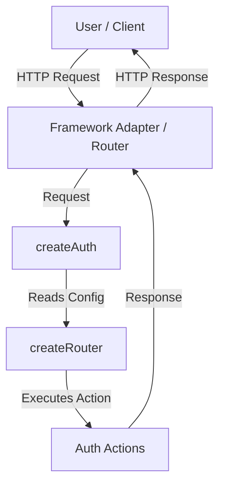
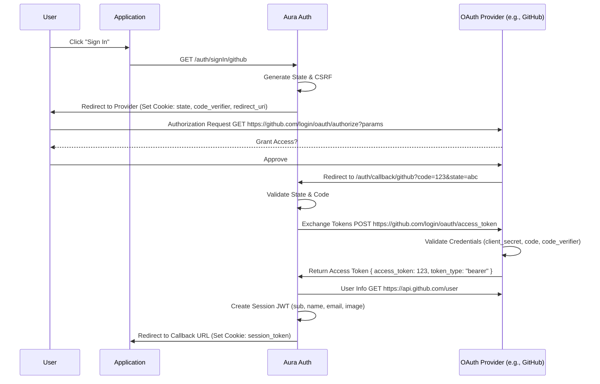

Aura Auth is built with a modular architecture enabling flexibility across different JavaScript environments.

## High-Level Overview

At its core, Aura Auth transforms configuration into a set of standard HTTP handlers. It does not strictly depend on any specific server framework (like Express or Hono) but instead communicates using standard Web API objects ([`Request`](https://developer.mozilla.org/en-US/docs/Web/API/Request) and [`Response`](https://developer.mozilla.org/en-US/docs/Web/API/Response)).

## Key Components

### 1. The Core (`createAuth`)

The entry point of the library. It accepts the `AuthConfig` and initializes the internal context, including:

- **OAuth Providers**: Set the OAuth providers to be consumed in the flow from the built-in oauth providers or custom oauth providers.
- **Cookie Store**: Granular cookie management that includes prefix name, cookie names and override attributes.
- **Secret**: Opaque value used to signing, encrypt and hash the session, csrfTokens and more internal secrets.
- **Base Path**: Path route where is located the `GET` and `POST` handlers.
- **Trusted Proxy Headers**: Detects the origin of the request when the application is behind a reverse proxy.

### 2. The Router (`@aura-stack/router`)

Aura Auth uses a lightweight internal router mechanism to dispatch requests to the correct "Action".

#### Actions

Actions are the units of logic that handle specific authentication tasks.

- **SignIn Action**: Prepares the authorization OAuth flow based on the OAuth 2.0 standard.
- **Callback Action**: Validates the provider's response, exchanges codes for tokens, and creates the session.
- **Session Action**: Reads the session cookie, verifies the JWT integrity, and returns user data.
- **CsrfToken Action**: Emits CSRF tokens for the critical signOut action.
- **SignOut Action**: Invalidates cookies.

## Data Flow: OAuth Sign-In

The following diagram illustrates the flow of data during a standard OAuth sign-in process.

## Responsibilities

| Component   | Responsibility                                              |
| :---------- | :---------------------------------------------------------- |
| **Config**  | Defines providers, secrets, and cookie settings.            |
| **Context** | Holds shared state like the JOSE instance and Cookie Store. |
| **Actions** | Implements the core logic for each auth route.              |

## Security Model Integration

The architecture deeply integrates security:

- **Cookies** are encrypted or signed.
- **State** checks prevent CSRF during OAuth flows.
- **PKCE** is used where applicable to secure the code exchange.
- **CSRF Token** is used to prevent cross-site request forgery attacks.
- **Key Derivation** creates deterministic derivation keys for security. Different keys are used for `signing`, `encryption`, and `csrfTokens`.
- **AURA_AUTH_SECRET** is an opaque value used to sign, encrypt, and hash the session, tokens, and salt values.
- **AURA_AUTH_SALT** is an opaque and deterministic value used to create derivation keys.

## Resources

- [The OAuth 2.0 Authorization Framework](https://datatracker.ietf.org/doc/html/rfc6749).
- [Proof Key for Code Exchange by OAuth Public Clients](https://datatracker.ietf.org/doc/html/rfc7636).
- [OAuth 2.0 Flow and Security in Delegated Authorization](/docs/concepts/oauth).
- [Environment Variables](/docs/configuration/env).
- [Cookie Configuration Option](/docs/configuration/options#cookies)
