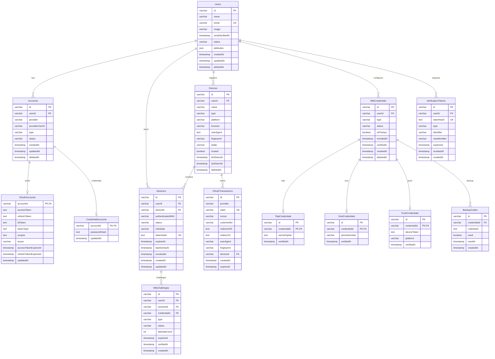

```mermaid
erDiagram
Users ||--o{ Accounts : "has"
Users ||--o{ Sessions : "starts"
Users ||--o{ Devices : "registers"
Users ||--o{ MfaCredentials : "configures"
Users ||--o{ VerificationTokens : "requests"
Accounts ||--o| OAuthAccounts : "oauth"
Accounts ||--o| CredentialAccounts : "credentials"
Devices ||--o{ Sessions : "contains"
Devices ||--o{ OAuthTransactions : "tracks"
MfaCredentials ||--o| TotpCredentials : "totp"
MfaCredentials ||--o| SmsCredentials : "sms"
MfaCredentials ||--o| PushCredentials : "push"
MfaCredentials ||--o{ BackupCodes : "backup"
Sessions ||--o{ MfaChallenges : "challenges"

Users {
    varchar id PK
    varchar name
    varchar email UK
    varchar image
    timestamp emailVerifiedAt
    varchar status
    json attributes
    timestamp createdAt
    timestamp updatedAt
    timestamp deletedAt
}

Accounts {
    varchar id PK
    varchar userId FK
    varchar provider
    varchar providerUserId
    varchar type
    varchar status
    timestamp createdAt
    timestamp updatedAt
    timestamp deletedAt
}

OAuthAccounts {
    varchar accountId PK,FK
    text accessToken
    text refreshToken
    text idToken
    text tokenType
    text scopes
    varchar issuer
    timestamp accessTokenExpiresAt
    timestamp refreshTokenExpiresAt
    timestamp updatedAt
}

CredentialAccounts {
  varchar accountId PK,FK
  text passwordHash
  timestamp updatedAt
}

Sessions {
    varchar id PK
    varchar userId FK
    varchar deviceId FK
    varchar authenticatedWith
    varchar status
    varchar mfaState
    text tokenHash UK
    timestamp expiresAt
    timestamp lastActivityAt
    timestamp revokedAt
    timestamp createdAt
    timestamp updatedAt
}

Devices {
    varchar id PK
    varchar userId FK
    varchar name
    varchar type
    varchar platform
    varchar browser
    text userAgent
    varchar fingerprint
    varchar lastIp
    boolean trusted
    timestamp firstSeenAt
    timestamp lastSeenAt
    timestamp deletedAt
}

MfaCredentials {
    varchar id PK
    varchar userId FK
    varchar type
    varchar status
    boolean isPrimary
    timestamp enrolledAt
    timestamp verifiedAt
    timestamp createdAt
    timestamp deletedAt
}

TotpCredentials {
  varchar id PK
  varchar credentialId PK,FK
  text secretCipher
  timestamp verifiedAt
}

SmsCredentials {
  varchar id PK
  varchar credentialId PK,FK
  varchar phoneNumber
  timestamp verifiedAt
}

PushCredentials {
  varchar id PK
  varchar credentialId PK,FK
  text deviceToken
  varchar platform
  timestamp verifiedAt
}

BackupCodes {
  varchar id PK
  varchar credentialId FK
  text codeHash
  boolean used
  timestamp usedAt
  timestamp createdAt
}

MfaChallenges {
  varchar id PK
  varchar userId FK
  varchar sessionId FK
  varchar credentialId FK
  varchar type
  varchar status
  int attemptCount
  timestamp expiresAt
  timestamp verifiedAt
  timestamp createdAt
}

VerificationTokens {
  varchar id PK
  varchar userId FK
  text tokenHash UK
  varchar type
  varchar identifier
  varchar newIdentifier
  timestamp expiresAt
  timestamp revokedAt
  timestamp createdAt
}

OAuthTransactions {
    varchar id PK
    varchar provider
    varchar state UK
    varchar nonce
    varchar codeVerifier
    text redirectURI
    text redirectTo
    varchar userAgent
    varchar fingerprint
    varchar deviceId FK
    timestamp createdAt
    timestamp expiresAt
}
```
