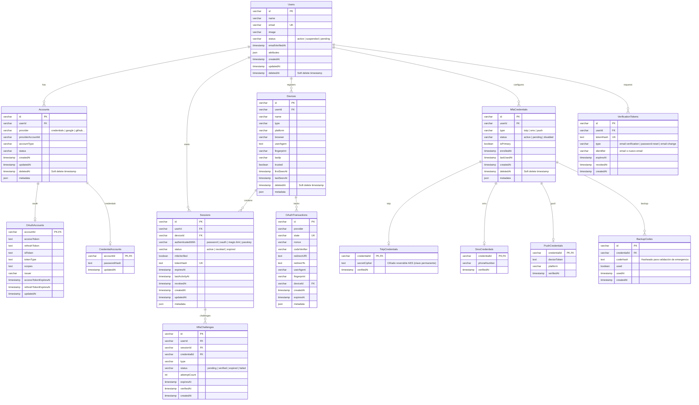

```mermaid
erDiagram
    Users ||--o{ Accounts : "has"
    Users ||--o{ Sessions : "starts"
    Users ||--o{ Devices : "registers"
    Users ||--o{ MfaCredentials : "configures"
    Users ||--o{ VerificationTokens : "requests"
    Accounts ||--o| OAuthAccounts : "oauth"
    Accounts ||--o| CredentialAccounts : "credentials"
    Devices ||--o{ Sessions : "contains"
    Devices ||--o{ OAuthTransactions : "tracks"
    MfaCredentials ||--o| TotpCredentials : "totp"
    MfaCredentials ||--o| SmsCredentials : "sms"
    MfaCredentials ||--o| PushCredentials : "push"
    MfaCredentials ||--o{ BackupCodes : "backup"
    Sessions ||--o{ MfaChallenges : "challenges"

    Users {
        varchar id PK
        varchar name
        varchar email UK
        varchar image
        varchar status "active | suspended | pending"
        timestamp emailVerifiedAt
        json attributes
        timestamp createdAt
        timestamp updatedAt
        timestamp deletedAt "Soft delete timestamp"
    }

    VerificationTokens {
        varchar id PK
        varchar userId FK
        text tokenHash UK
        varchar type "email-verification | password-reset | email-change"
        varchar identifier "email o nuevo email"
        timestamp expiresAt
        timestamp revokedAt
        timestamp createdAt
    }

    Accounts {
        varchar id PK
        varchar userId FK
        varchar provider "credentials | google | github..."
        varchar providerAccountId
        varchar accountType
        varchar status
        timestamp createdAt
        timestamp updatedAt
        timestamp deletedAt "Soft delete timestamp"
        json metadata
    }

    OAuthAccounts {
        varchar accountId PK,FK
        text accessToken
        text refreshToken
        text idToken
        text tokenType
        text scopes
        varchar issuer
        timestamp accessTokenExpiresAt
        timestamp refreshTokenExpiresAt
        timestamp updatedAt
    }

    CredentialAccounts {
        varchar accountId PK,FK
        text passwordHash
        timestamp updatedAt
    }

    Sessions {
        varchar id PK
        varchar userId FK
        varchar deviceId FK
        varchar authenticatedWith "password | oauth | magic-link | passkey"
        varchar status "active | revoked | expired"
        boolean mfaVerified
        text tokenHash UK
        timestamp expiresAt
        timestamp lastActivityAt
        timestamp revokedAt
        timestamp createdAt
        timestamp updatedAt
        json metadata
    }

    Devices {
        varchar id PK
        varchar userId FK
        varchar name
        varchar type
        varchar platform
        varchar browser
        text userAgent
        varchar fingerprint
        varchar lastIp
        boolean trusted
        timestamp firstSeenAt
        timestamp lastSeenAt
        timestamp deletedAt "Soft delete timestamp"
        json metadata
    }

    MfaCredentials {
        varchar id PK
        varchar userId FK
        varchar type "totp | sms | push"
        varchar status "active | pending | disabled"
        boolean isPrimary
        timestamp enrolledAt
        timestamp lastUsedAt
        timestamp createdAt
        timestamp deletedAt "Soft delete timestamp"
        json metadata
    }

    TotpCredentials {
        varchar credentialId PK,FK
        text secretCipher "Cifrado reversible AES (clave permanente)"
        timestamp verifiedAt
    }

    SmsCredentials {
        varchar credentialId PK,FK
        varchar phoneNumber
        timestamp verifiedAt
    }

    PushCredentials {
        varchar credentialId PK,FK
        text deviceToken
        varchar platform
        timestamp verifiedAt
    }

    BackupCodes {
        varchar id PK
        varchar credentialId FK
        text codeHash "Hasheado para validación de emergencia"
        boolean used
        timestamp usedAt
        timestamp createdAt
    }

    MfaChallenges {
        varchar id PK
        varchar userId FK
        varchar sessionId FK
        varchar credentialId FK
        varchar type
        varchar status "pending | verified | expired | failed"
        int attemptCount
        timestamp expiresAt
        timestamp verifiedAt
        timestamp createdAt
    }

    OAuthTransactions {
        varchar id PK
        varchar provider
        varchar state UK
        varchar nonce
        varchar codeVerifier
        text redirectURI
        text redirectTo
        varchar userAgent
        varchar fingerprint
        varchar deviceId FK
        timestamp createdAt
        timestamp expiresAt
        json metadata
    }
```
