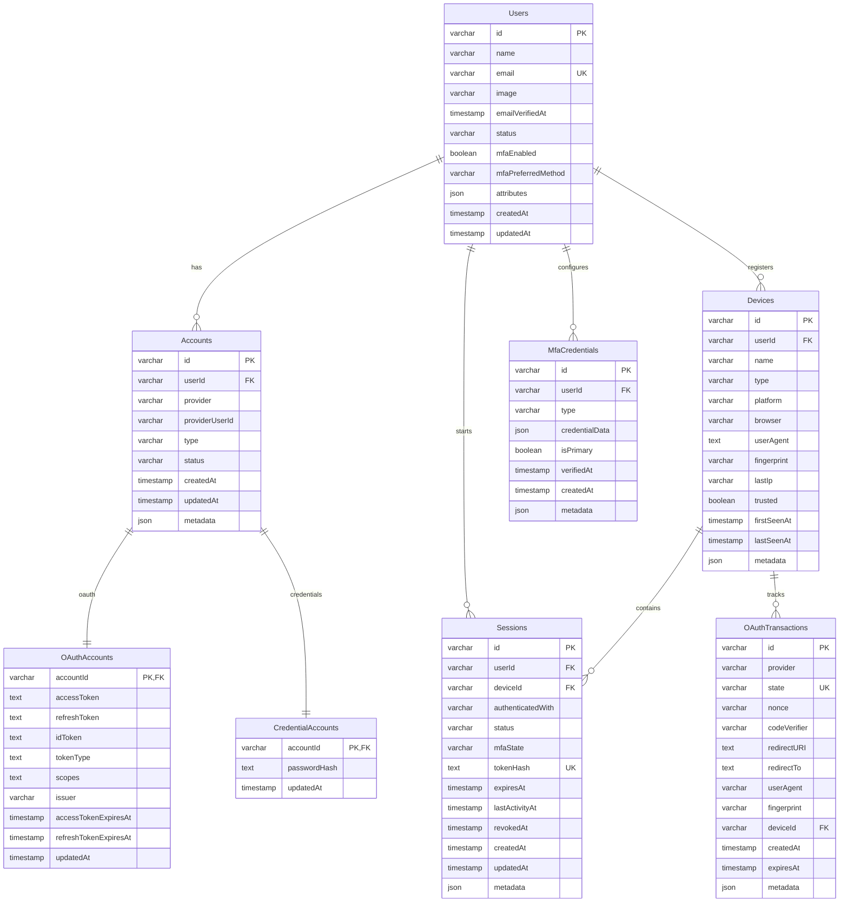

```mermaid
erDiagram
Users ||--o{ Accounts : "has"
Users ||--o{ Sessions : "starts"
Users ||--o{ Devices : "registers"
Users ||--o{ MfaCredentials : "configures"
Accounts ||--|| OAuthAccounts : "oauth"
Accounts ||--|| CredentialAccounts : "credentials"
Devices ||--o{ Sessions : "contains"
Devices ||--o{ OAuthTransactions : "tracks"

Users {
    varchar id PK
    varchar name
    varchar email UK
    varchar image
    timestamp emailVerifiedAt
    varchar status
    boolean mfaEnabled
    varchar mfaPreferredMethod
    json attributes
    timestamp createdAt
    timestamp updatedAt
}
Accounts {
    varchar id PK
    varchar userId FK
    varchar provider
    varchar providerUserId
    varchar type
    varchar status
    timestamp createdAt
    timestamp updatedAt
    json metadata
}
OAuthAccounts {
    varchar accountId PK,FK
    text accessToken
    text refreshToken
    text idToken
    text tokenType
    text scopes
    varchar issuer
    timestamp accessTokenExpiresAt
    timestamp refreshTokenExpiresAt
    timestamp updatedAt
    }
    CredentialAccounts {
    varchar accountId PK,FK
    text passwordHash
    timestamp updatedAt
}
Sessions {
    varchar id PK
    varchar userId FK
    varchar deviceId FK
    varchar authenticatedWith
    varchar status
    varchar mfaState
    text tokenHash UK
    timestamp expiresAt
    timestamp lastActivityAt
    timestamp revokedAt
    timestamp createdAt
    timestamp updatedAt
    json metadata
}
Devices {
    varchar id PK
    varchar userId FK
    varchar name
    varchar type
    varchar platform
    varchar browser
    text userAgent
    varchar fingerprint
    varchar lastIp
    boolean trusted
    timestamp firstSeenAt
    timestamp lastSeenAt
    json metadata
}
MfaCredentials {
    varchar id PK
    varchar userId FK
    varchar type
    json credentialData
    boolean isPrimary
    timestamp verifiedAt
    timestamp createdAt
    json metadata
}
OAuthTransactions {
    varchar id PK
    varchar provider
    varchar state UK
    varchar nonce
    varchar codeVerifier
    text redirectURI
    text redirectTo
    varchar userAgent
    varchar fingerprint
    varchar deviceId FK
    timestamp createdAt
    timestamp expiresAt
    json metadata
}
```
